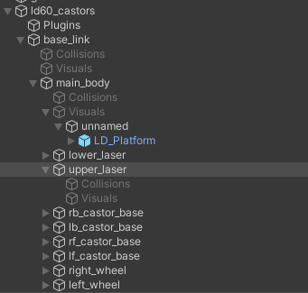
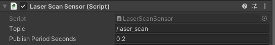

# NBL_Project
Nokia Bell Labs Project repo containing both unity project and required ROS packages

## Usage

1. Clone into local workspace `src`. Build and source.

2. Open the unity project [Omron_LD60](./Unity/Omron_LD60) from the Unity Hub. Using editor version **2020.3.30f1**.

3. Launch the TCP endpoint on the ROS side with `roslaunch ros_tcp_endpoint endpoint.launch`.

4. Press the play button to run the scene in the Unity Editor.

5. Open up RVIZ with `roslaunch omron_ld60_description load_description.launch`

6. Use teleop twist keyboard to move.

## Lidar Specifics
The lidar script is added as a component of the `upper_laser` link/childObject.

The publishing rate can be set in the inspector window.

**Note**: Decreasing publishing period (increasing update rate) is not guaranteed to reflect in simulation. In the event that the actual publishing rate lags behind the set publishing rate this warning will be visible in the console window.

